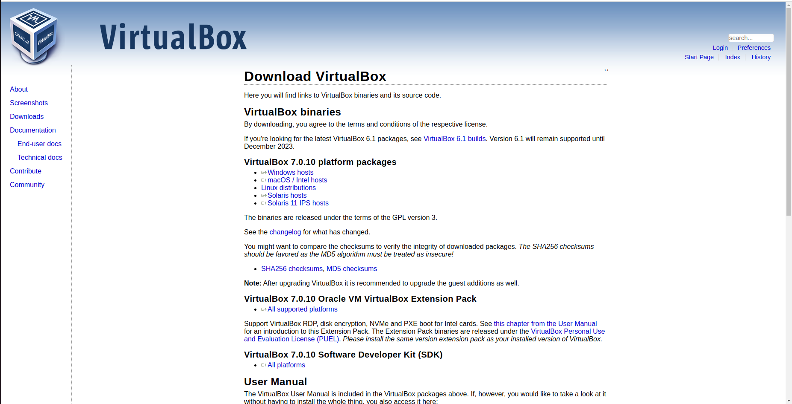
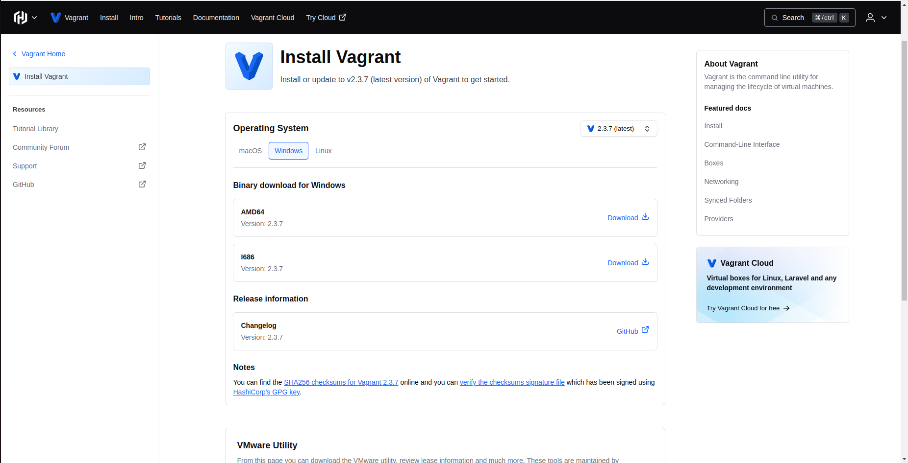
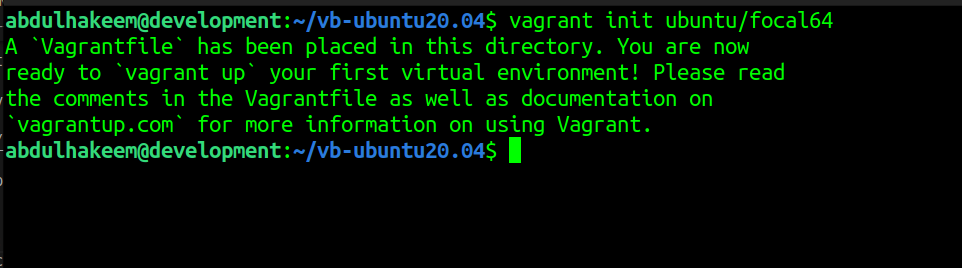
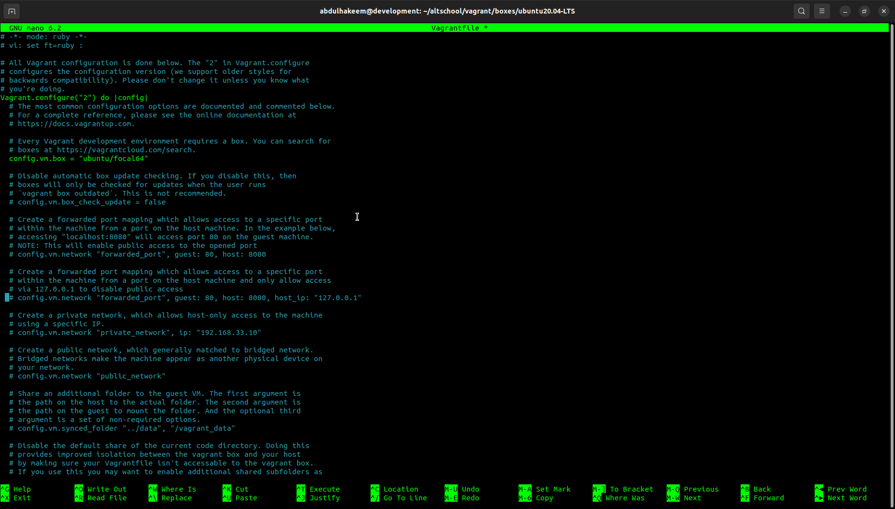
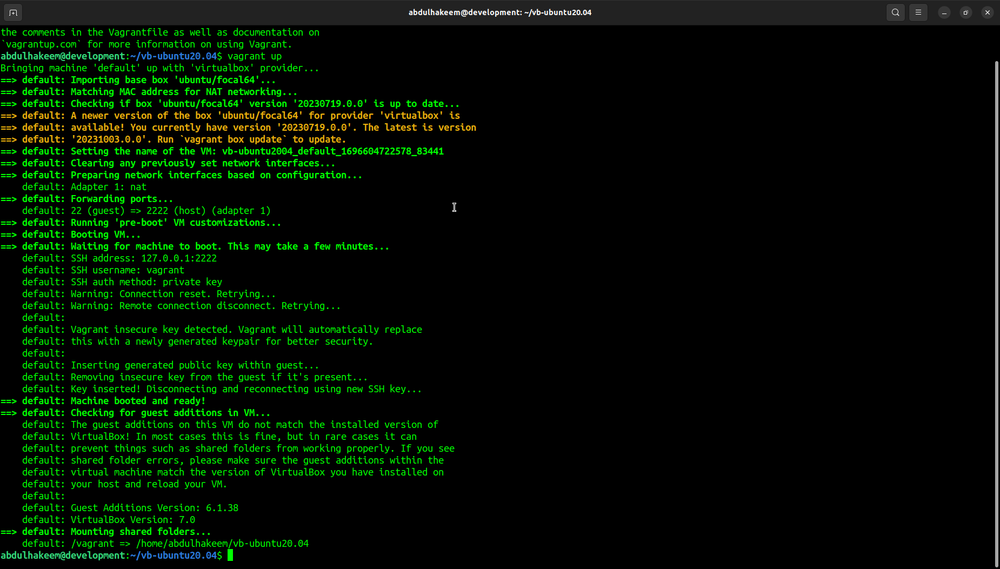
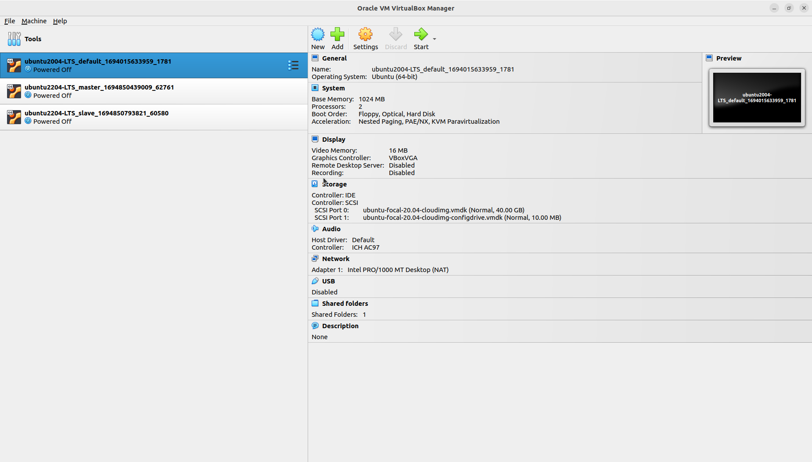
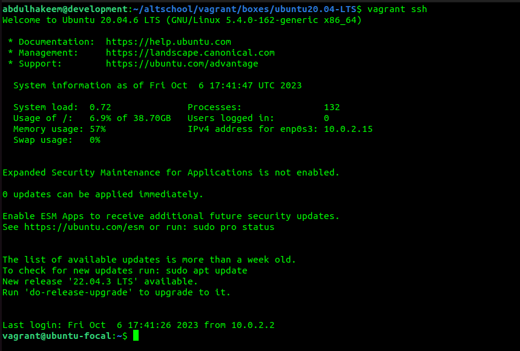

## SETTING UP UBUNTU 20.04-LTS USING VAGRANT

**Step 1** : Install a virtualization software.  
Here I want to use VirtualBox, of course you can use any other virtualization software you like.  
To download virtualbox go to: [virtualbox website](https://www.virtualbox.org/wiki/Downloads)

Select the operating system that matches the OS on your computer. Then follow the procedure to install the virtualbox.

**Step 2**: Download and install vagrant.  
To download vagrant go to: [vagrant website](https://developer.hashicorp.com/vagrant/downloads?product_intent=vagrant)  
Again, choose the operating system that matches the OS on your computer, and then follow the procedure to install vagrant.
  
I am using ubuntu on my computer, so to install vagrant i will install it from my terminal.  
`sudo apt update -y`  
  
`sudo apt-get install vagrant`

**Step 3** : Initialize a project directory where vagrant will keep it's configuration file.
Here I will create a directory called `vb-ubuntu20.04` then switch into the directory.

**Step 4**  
In the directory, do: `vagrant init ubuntu/focal64`  
This will initialize vagrant and then create a `Vagrantfile` in the directory. Vagrantfile is a configuration file where vagrant gets instructions on how to setup the virtual machine.  
It contains specifications for: cpu cores, memory size, os type, network settings and other configuration options.
  
You can also edit the vagrant file to change some of the default configuration options contained in it. You can learn about how to write Vagrantfile on vagrant website. Ensure that you know what you are doing before changing any line in the file, otherwise leave the default configuration and proceed.

**Step 5**  
Do: `vagrant up`  
This will create the virtual machine and install Ubuntu Operating System simultaneously, handling the user interaction processes in the background, that could have been performed if I was to install an OS from a CD or a bootable flash drive.  
  
**NOTE**  
Vagrant has a remote repository where it keeps copies of OS images, there are tons of OS image and their versions in this repository, so when you run `vagrant up` it lookup the repository to fetch the image of OS which has been specified in the configuration file (Vagrantfile) then installs in automatically.  
Vagrant also has the capability to first checks the system if there is a sample of the virtual machine image for the Ubuntu version specified in the Vagrantfile (probably from a previous installation), before downloading a fresh copy of the image.

**Step 6**  
Now, our virtual machine is ready and we can access the system from the VirtualBox window by selecting the vm and starting the virtual machine.

OR

Do: `vagrant ssh`: to login to the system remotely from your terminal.  

